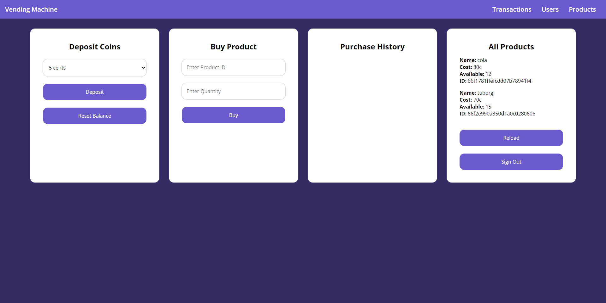

# Vending Machine

This project is a REST API for a vending machine that allows different user roles, sellers and buyers, to interact with products and transactions. The vending machine accepts specific coins (5, 10, 20, 50, 100 cents) and users can perform various actions based on their role. Users can interact with the REST API through a simple web interface.


## Features

- **Authentication:** Secure access using JWT authentication.
- **Role-based Access:**
  - **Sellers:** Can manage products through CRUD operations. They can't delete or update other sellers products, but only their own.
  - **Buyers:** Can deposit coins, buy products and reset their deposit, through CRUD operations.


## Tech Stack

**Client:** JavaScript, HTML, CSS

**Server:** Node.js, Express.js, MongoDB

**Tools:** Postman


## API Documentation

[Postman](https://documenter.getpostman.com/view/38513841/2sAXqtc2Zf)


## Project Structure

```bash
.
└── vending-machine-api/
    ├── node_modules
    ├── client/
    │   ├── favicon.ico
    │   ├── index.html
    │   ├── products.html
    │   ├── transactions.html
    │   ├── users.html
    │   ├── script.js
    │   └── styles.css
    ├── config/
    │   └── db.js
    ├── controllers/
    │   ├── authController.js
    │   ├── productController.js
    │   ├── transactionController.js
    │   └── userController.js
    ├── middlewares/
    │   ├── authMiddleware.js
    │   └── roleMiddleware.js
    ├── models/
    │   ├── productModel.js
    │   └── userModel.js
    ├── routes/
    │   ├── authRoutes.js
    │   ├── productRoutes.js
    │   ├── transactionRoutes.js
    │   └── userRoutes.js
    ├── .env
    ├── .gitignore
    ├── index.js
    ├── package-lock.json
    └── package.json

```

## Run Locally

Install dependencies

```bash
  npm install
```

Start the server

```bash
  npm run start
```

## Environment

Before you run the server, you should create an `.env` file in the root folder using your own variables, e.g.

`DB_URL = mongodb://localhost:27017/vending_machine_db`

`PORT = 5000`

`NODE_ENV = DEVELOPMENT`

`JWT_SECRET = MY-32-CHARACTER-ULTRA-SECURE-AND-ULTRA-LONG-KEY`

## Screenshots


